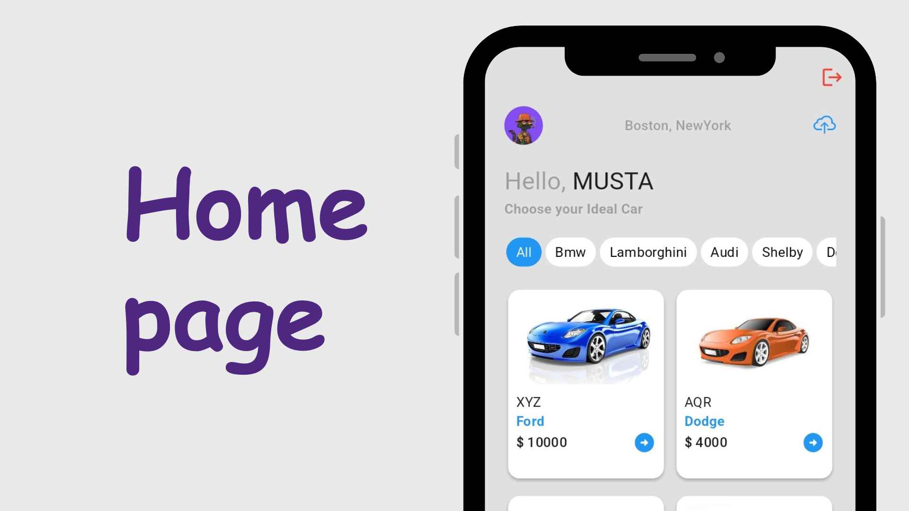
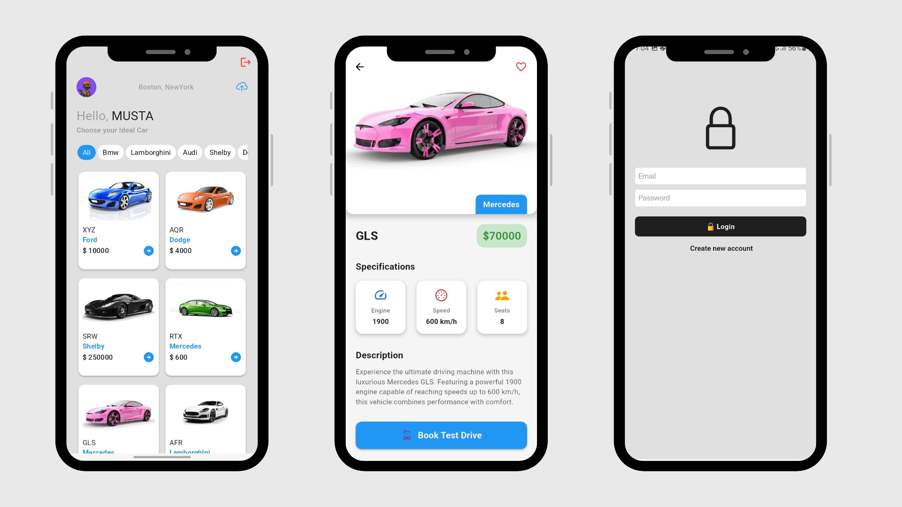
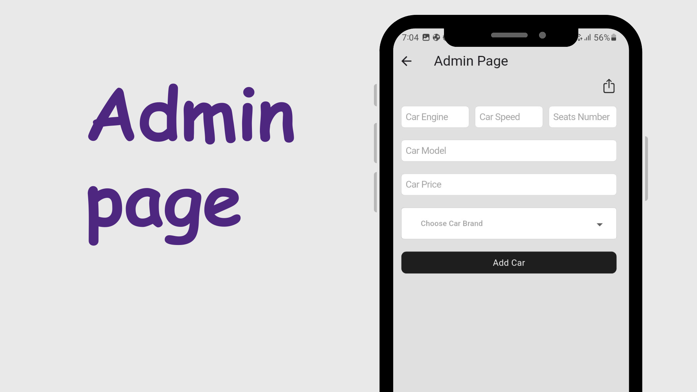

# 🚗 CarMart Flutter App

Welcome to **CarMart** – a modern, cross-platform car marketplace app built with Flutter and Firebase! 

---

## ✨ Features

- 🔐 **Authentication**: Secure login & registration with Firebase Auth
- 🏠 **Home Page**: Browse cars by brand, filter, and view details
- 🚘 **Car Details**: See car images, specs, and book a test drive
- 🛠️ **Admin Panel**: Add new cars, upload images, and manage inventory
- ⚡ **Shimmer Loading**: Smooth loading animations for a polished UX
- 🔄 **Pull-to-Refresh**: Instantly refresh car listings
- 🌐 **Multi-Platform**: Runs on Android, iOS, Web, Windows, macOS, and Linux

---

## 📸 Screenshots

| Home Page | Car Details | Admin Panel |
|:---------:|:-----------:|:-----------:|
|  |  |  |
| Brand Filter | Add Car | Shimmer Effect |
|  |  |  |

---

## 🛠️ Tech Stack

- **Flutter** (Dart)
- **Firebase** (Auth, Firestore, Storage)
- **flutter_dotenv** for secure API key management

---

## 🚀 Getting Started

1. **Clone the repo**
2. Add your Firebase config files and `.env` (see `.env.example`)
3. Run `flutter pub get`
4. Launch on your favorite platform!

---

## 🔒 Security
- All API keys and secrets are managed via `.env` and are **never** committed to Git.
- Sensitive files like `google-services.json` and `GoogleService-Info.plist` are gitignored.

---

## 🤝 Contributing
Pull requests are welcome! For major changes, please open an issue first.

---

## 📄 License
MIT

---

Enjoy using CarMart! 🚙💨
